# Trippo - The Travel Guide


:boom: One travel guide for the whole world. It's free.

Trippo is your smart travel guide - it’s free and works offline, too! Our awesome algorithms crunch through millions of websites and reviews to deliver unique recommendations across 50,000 destinations worldwide! Personalize your trip by picking your favorite hotels, sights, activities and restaurants and book them seamlessly in our app! You can skim through tours, locations, POIs, city walks, articles and so on. This guide will save you from a serious headache!

This project is powered by **Triposo.com.** To get your own Account Id and Token, please visit [Triposo](https://www.triposo.com/)

Download [Trippo](https://play.google.com/store/apps/details?id=com.nuhkoca.trippo) and start discovering the world today.

### Configuration

In order to run this project, you need to get an **account id** and **token** from[**Triposo.**](https://www.triposo.com/api/)

You need to set your account id and token in the `gradle.properties` file as follows:

    ACCOUNT_ID = "your account id"
    API_TOKEN = "your token"

You also need create a Firebase Project and download **google-services.json**
in order to use Firebase Admob, Crashlytics and Authentication. Please refer to [Firebase Console](https://console.firebase.google.com/u/0/)

You also need browser and API keys in order to use Google Maps with Nearby Places. Please refer to [Developer Console](https://console.developers.google.com/)

### Features

- [x] Users can sign-in with Google Auth.
- [x] Users can find nearby places up to 5km.
- [x] 225 countries are available in total.
- [x] Users can add any country to their favorite lists.
- [x] Added Day/Night Mode.
- [x] A comprehensive detail page for each of the countries helps you out to find everything.
- [x] Users can book any activity by activating bookable option.
- [x] Users can show any landmark/country in the map.
- [x] The app reads too long articles to users.
- [x] Users receive remindful notifications. They can also switch off notifications if wish.
- [x] Users can view favorite items in widget for a quicker access.

### Soon

- [ ] BottomAppBar will be implemented once Support Library v28 is in the stable version.
- [ ] Images for selected locations will be added.
- [ ] Route calculation between two locations selected will be integrated.
- [ ] Detail Screen for cities, regions, national parks and island of the selected country will be added.

### Screenshots

#### Phone

Onboarding Screen             |  Signup Screen |  Map Screen
:-------------------------:|:-------------------------:|:-------------------------:
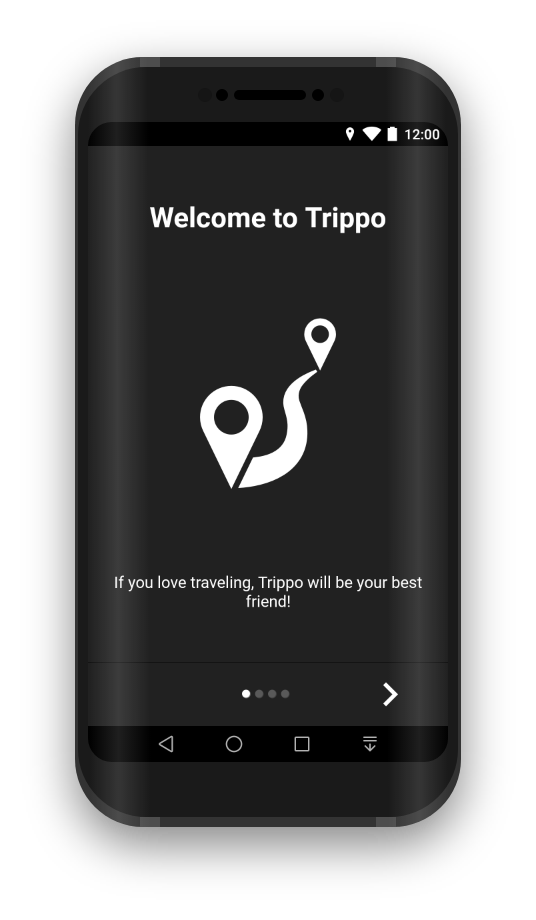  |  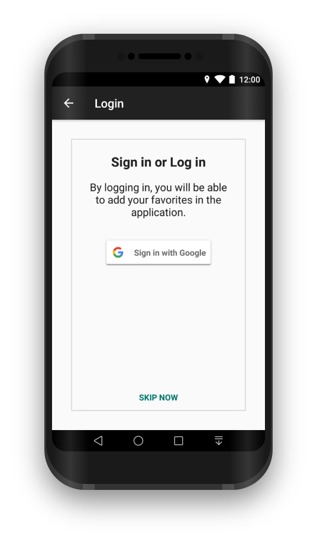 |  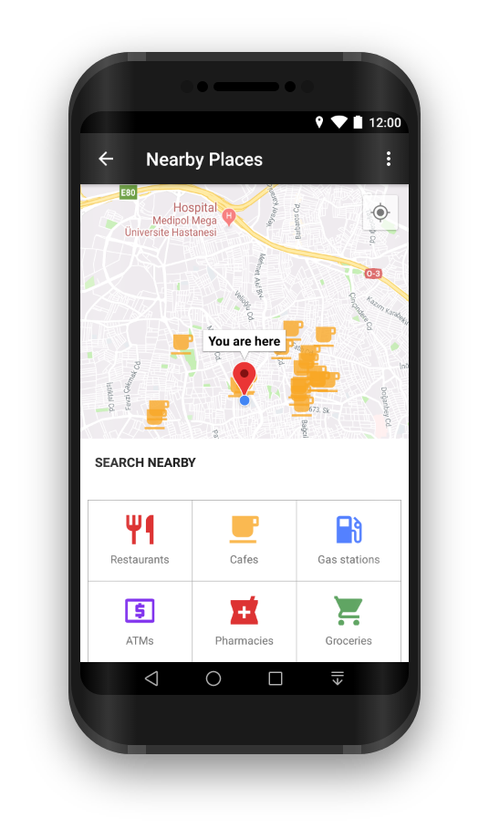

Login Screen             |  Settings Screen |  Catalogue Screen
:-------------------------:|:-------------------------:|:-------------------------:
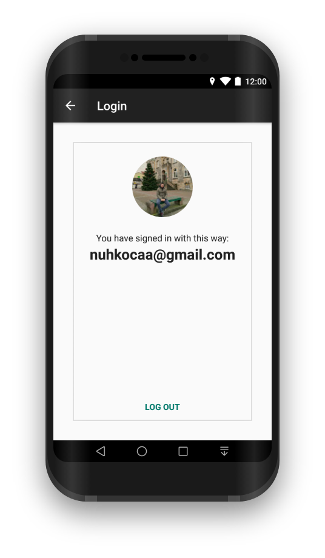  |  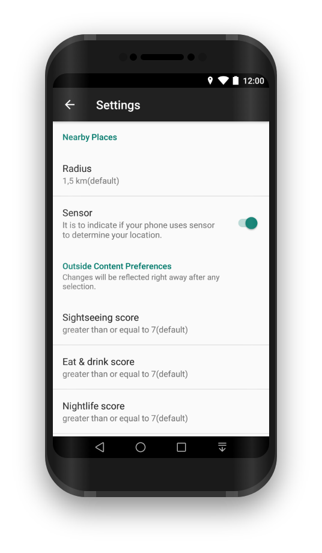 |  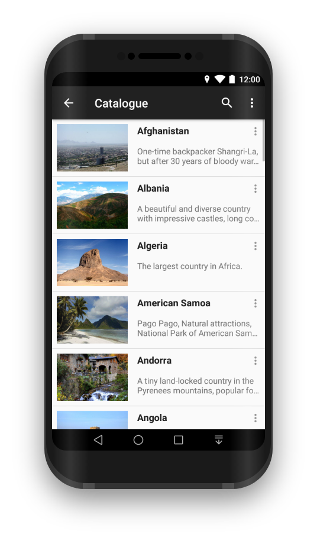

Favorites Screen             |  Detail Screen |  Content of Country Screen
:-------------------------:|:-------------------------:|:-------------------------:
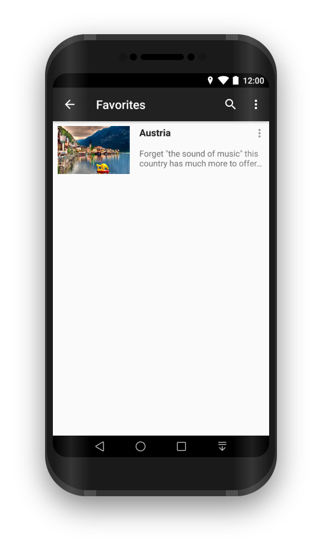  |  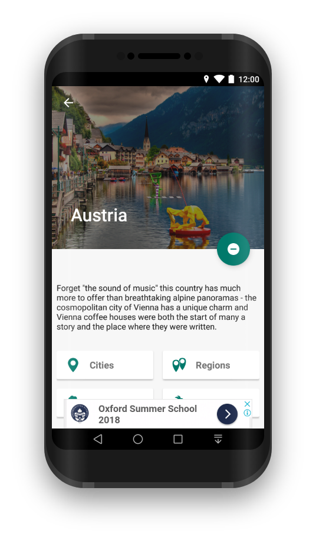 |  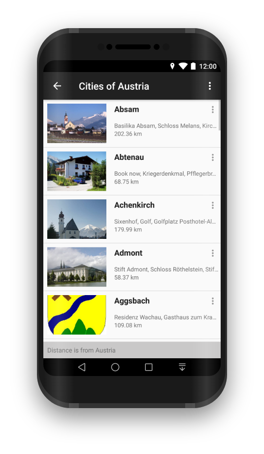

Outside of City Screen             |  Book Screen |  Article Screen
:-------------------------:|:-------------------------:|:-------------------------:
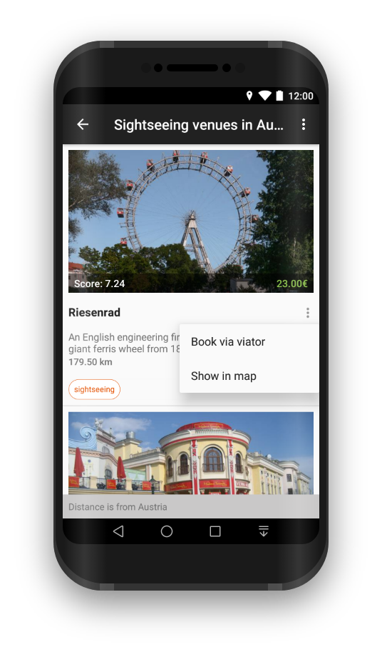  |  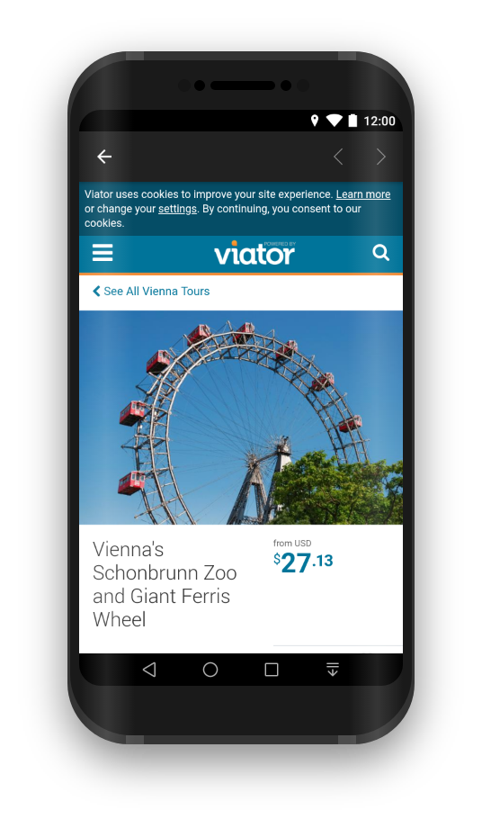 |  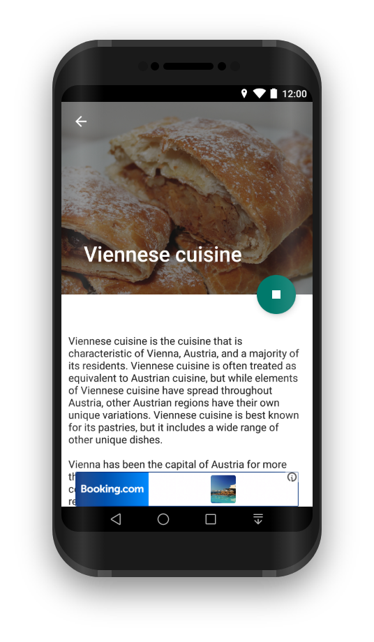

#### Tablet
_Soon_

### Credits

* [Support Library](https://developer.android.com/topic/libraries/support-library/)
* [MVVM Pattern](https://github.com/googlesamples/android-architecture)
* [Architecture Components](https://developer.android.com/topic/libraries/architecture/)
* [BindingAdapter](https://developer.android.com/reference/android/databinding/BindingAdapter.html)
* [ConstraintLayout](https://developer.android.com/training/constraint-layout/)
* [Retrofit2](https://github.com/square/retrofit)
* [RxJava2](https://github.com/ReactiveX/RxJava)
* [Glide](https://github.com/bumptech/glide)
* [GlideModule](http://bumptech.github.io/glide/doc/generatedapi.html#availability)
* [Timber](https://github.com/JakeWharton/timber)
* [LeakCanary](https://github.com/square/leakcanary)
* [OkHttp](https://github.com/square/okhttp)
* [DataBinding](https://developer.android.com/topic/libraries/data-binding/index.html)
* [Room Persistence Library](https://github.com/googlecodelabs/android-room-with-a-view)
* [Paging Library](https://developer.android.com/topic/libraries/architecture/paging/)
* [PreferenceScreen v14](https://developer.android.com/reference/android/preference/Preference)
* [Stetho](http://facebook.github.io/stetho/)
* [Android About Page](https://github.com/medyo/android-about-page)
* [Espresso](https://github.com/googlesamples/android-testing)
* [About Libraries](https://github.com/mikepenz/AboutLibraries)
* [Firebase & Firestore](https://firebase.google.com/docs/firestore/)
* [Google Maps](https://developers.google.com/maps/documentation/android-sdk/intro)
* [Firebase Auth](https://firebase.google.com/docs/auth/)
* [Google Admob](https://www.google.com/admob/)
* [AppIntro](https://github.com/apl-devs/AppIntro)
* [Fabric Crashlytics](https://fabric.io/kits/android/crashlytics)
* [EasyPermission](https://github.com/googlesamples/easypermissions)
* [CircleImageView](https://github.com/hdodenhof/CircleImageView)
* [AndroidTagView](https://github.com/whilu/AndroidTagView)


### License

**App icon based on:**

Icons made by Freepik from www.flaticon.com is licensed by CC 3.0 BY

**Some icons in the app based on:**

Icons made by Freepik from www.flaticon.com is licensed by CC 3.0 BY

```
MIT License

Copyright (c) 2018 Nuh Koca

Permission is hereby granted, free of charge, to any person obtaining a copy
of this software and associated documentation files (the "Software"), to deal
in the Software without restriction, including without limitation the rights
to use, copy, modify, merge, publish, distribute, sublicense, and/or sell
copies of the Software, and to permit persons to whom the Software is
furnished to do so, subject to the following conditions:

The above copyright notice and this permission notice shall be included in all
copies or substantial portions of the Software.

THE SOFTWARE IS PROVIDED "AS IS", WITHOUT WARRANTY OF ANY KIND, EXPRESS OR
IMPLIED, INCLUDING BUT NOT LIMITED TO THE WARRANTIES OF MERCHANTABILITY,
FITNESS FOR A PARTICULAR PURPOSE AND NONINFRINGEMENT. IN NO EVENT SHALL THE
AUTHORS OR COPYRIGHT HOLDERS BE LIABLE FOR ANY CLAIM, DAMAGES OR OTHER
LIABILITY, WHETHER IN AN ACTION OF CONTRACT, TORT OR OTHERWISE, ARISING FROM,
OUT OF OR IN CONNECTION WITH THE SOFTWARE OR THE USE OR OTHER DEALINGS IN THE
SOFTWARE.
```
